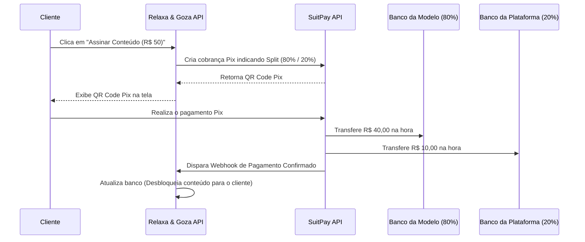

# Venda de Conteúdo com Split Automático de Pagamentos (Estilo Privacy/OnlyFans)

Este documento registra a ideia, requisitos e plano de arquitetura para a futura implementação da venda de fotos/vídeos e assinaturas exclusivas das modelos no portal **Relaxa & Goza** com divisão de receita automática.

---

## 🌟 Visão Geral

Permitir que as modelos monetizem conteúdos exclusivos diretamente pela plataforma através de:
1. **Assinaturas Mensais Recorrentes:** Acesso total a todas as mídias premium da modelo enquanto a assinatura estiver ativa.
2. **Álbuns/Vídeos Avulsos (PPV - Pay-Per-View):** Compra única para desbloquear um conteúdo específico.

O sistema processará os pagamentos via **Pix (SuitPay ou gateway de alto risco equivalente)** e fará o **Split Automático** (ex: 80% do valor vai direto para a conta da modelo e 20% fica como comissão da plataforma).

---

## 💾 Modelagem de Dados (Supabase / Postgres)

Precisaremos criar as seguintes tabelas para controle de acessos e assinaturas:

### 1. `premium_media` (Mídias Premium)
Armazena a referência das fotos/vídeos bloqueados.
* `id` (UUID, Primary Key)
* `profile_id` (UUID, FK para `profiles.id`)
* `title` (VARCHAR)
* `description` (TEXT)
* `price_cents` (INTEGER, nulo se fizer parte da assinatura mensal, preenchido se for PPV)
* `media_url` (VARCHAR, caminho no storage privado)
* `preview_url` (VARCHAR, miniatura borrada para exibição pública)
* `media_type` (VARCHAR, 'photo' | 'video')
* `created_at` (TIMESTAMP)

### 2. `premium_subscriptions` (Assinaturas Ativas)
Armazena o controle de acesso de assinantes.
* `id` (UUID, Primary Key)
* `client_id` (UUID, FK para `profiles.id`)
* `provider_id` (UUID, FK para `profiles.id`)
* `status` (VARCHAR, 'active' | 'expired')
* `expires_at` (TIMESTAMP)
* `created_at` (TIMESTAMP)

### 3. `premium_purchases` (Vendas Avulsas / PPV)
Registra quais usuários compraram quais álbuns.
* `id` (UUID, Primary Key)
* `client_id` (UUID, FK para `profiles.id`)
* `media_id` (UUID, FK para `premium_media.id`)
* `amount_paid_cents` (INTEGER)
* `created_at` (TIMESTAMP)

---

## 🔒 Regras de Segurança e Paywall

* **Storage Privado:** Os arquivos originais de mídia devem ser salvos em um bucket privado no Supabase (`premium-media-private`).
* **Signed URLs:** Apenas usuários com assinatura ativa ou compra do álbum terão acesso a links de curta duração gerados dinamicamente via políticas de banco de dados (RLS).
* **Desativação de Download:** Aplicar blindagem via CSS/JavaScript (`onContextMenu`, `onDragStart`, player customizável) para dificultar capturas e downloads simples de vídeo e imagem.

---

## 💸 Fluxo do Split Automático (Exemplo SuitPay)

---

## 🎨 Componentes da Interface a Desenvolver

1. **Aba "Exclusivos" no Perfil da Modelo (`/perfil/[id]`):**
   - Miniaturas de fotos/vídeos com filtro CSS de desfoque (`backdrop-filter: blur(10px)`) e ícone de cadeado.
   - Banners informativos e botões de checkout: "Desbloquear Canal" e "Comprar Álbum".

2. **Dashboard Administrativo da Modelo (`/dashboard/premium`):**
   - Formulário para definir o valor da assinatura.
   - Cadastro de dados de pagamento / chave Pix.
   - Upload de mídias com drag-and-drop categorizado.
   - Painel de ganhos e histórico de vendas/assinantes.
